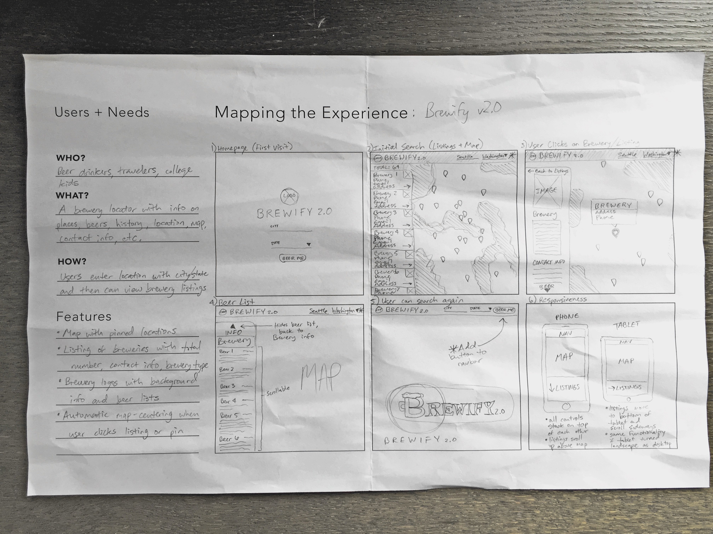
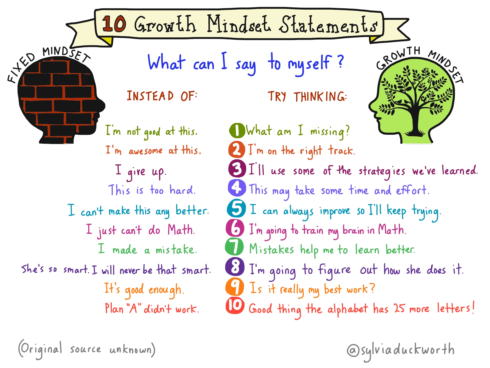

# Web Development Q1 Project

The goal of this project is to demonstrate your mastery of the concepts covered over the past quarter. Like your capstone, you're expected to come up with a project idea and implement it all on your own. Unlike a PhD dissertation, you are _not_ expected to discover and publish an idea that's never been done before. Asking your classmates and instructors for help throughout the process is strongly encouraged, but your work must be your own.

During project week, you'll have approximately 24 hours of class time to implement your idea. It'll most likely not be enough time, so plan on allocating extra time for it outside of class. On the last day of project week, you'll give short demonstration of your project to the class.

### Table of Contents

1. [Understand the technical requirements](#understand-the-technical-requirements)
1. [Submit two project proposals for approval](#submit-two-project-proposals-for-approval)
1. [Use a software development process](#use-a-software-development-process)
1. [Pay attention to your mindset](#pay-attention-to-your-mindset)
1. [Demonstrate your project to the class](#demonstrate-your-project-to-the-class)
1. [Complete a write-up of the project](#complete-a-write-up-of-the-project)
1. [Submit your project for assessment](#submit-your-project-for-assessment)
1. [Update your online portfolio](#update-your-online-portfolio)

### Understand the technical requirements

To get started, fork and clone this repository. The technical requirements for your project are as follows.

- Have [valid](https://validator.w3.org/nu/), well-indented, and semantic HTML.
- Have [valid](https://jigsaw.w3.org/css-validator/), well-indented, and minimally-specific CSS.
- Have [linted](http://eslint.org/), readable, and concise JavaScript.
- Use embedded media like fonts, images, audio, or video.
- Use a front-end framework like Bootstrap, Foundation, or Materialize.
- Respond to form input and/or user events.
- Connect to at least one external web API via Ajax.
- Be deployed to a production environment.

#### Bonuses

- Customize the color palette or theme of your front-end framework.
- Optimize for various viewport sizes using responsive design.
- Develop a game instead of an application.
- Or connect to external hardware like an Arduino or MIDI keyboard.

#### Application ideas

- A nutrition tracker
- A documentation aggregator
- A ping-pong tournament tracker
- A message encryptor
- A journey mapper
- A brewery locator
- An audio sequencer
- A synonym finder
- A real-time chatroom

#### Game ideas

- Asteroids
- Battleship
- Blackjack
- Breakout
- Flash cards
- Sudoku
- Tetris

#### Web APIs

- [Bacon Ipsum](http://baconipsum.com/json-api/)
- [Big Huge Thesaurus](http://words.bighugelabs.com/api.php)
- [COLOURlovers](http://www.colourlovers.com/api)
- [Crunchbase](https://data.crunchbase.com/v3/docs/using-the-api)
- [data.seattle.gov](https://data.seattle.gov/)
- [Etsy](https://www.etsy.com/developers/documentation)
- [Firebase](https://firebase.google.com/docs/web/setup)
- [Flickr](https://www.flickr.com/services/api/)
- [Gilt](https://dev.gilt.com/documentation/overview.html)
- [GitHub](https://developer.github.com/)
- [Google Books](https://developers.google.com/books/docs/v1/using)
- [Google Knowledge Graph](https://developers.google.com/knowledge-graph/)
- [Google Geocoding](https://developers.google.com/maps/documentation/geocoding/start)
- [Google Maps](https://developers.google.com/maps/documentation/javascript/)
- [Google Places](https://developers.google.com/maps/documentation/javascript/places#overview)
- [Gravatar](http://en.gravatar.com/site/implement/)
- [Groupon](https://www.groupon.com/pages/api)
- [JSONPlaceholder](http://jsonplaceholder.typicode.com/)
- [Lob](https://lob.com/docs)
- [Mapbox](https://www.mapbox.com/api-documentation/)
- [Markit](http://dev.markitondemand.com/MODApis/)
- [OpenTok](https://tokbox.com/developer/rest/)
- [OpenWeatherMap](http://openweathermap.org/api)
- [Reddit](https://www.reddit.com/dev/api)
- [Rotten Tomatoes](http://developer.rottentomatoes.com/docs/read/JSON)
- [Snooth Wine](http://api.snooth.com/)
- [SoundCloud](https://developers.soundcloud.com/docs/api/reference)
- [(Hacker)Space](http://spaceapi.net/)
- [Stripe](https://stripe.com/docs/api#intro)
- [SF OpenData](https://data.sfgov.org/)
- [theguardian](http://open-platform.theguardian.com/)
- [Transitland](https://transit.land/documentation/)
- [Tumblr](https://www.tumblr.com/docs/en/api/v2)
- [Twitch.tv](https://github.com/justintv/Twitch-API)
- [Unsplash](https://unsplash.com/documentation)
- [Weather Underground](http://api.wunderground.com/weather/api/d/docs)
- [Wolfram Alpha](http://products.wolframalpha.com/api/)
- [Wordnik](http://developer.wordnik.com/docs.html)
- [xkcd](https://xkcd.com/json.html)
- [Youtube](https://developers.google.com/youtube/v3/getting-started)

Or browse the [ProgrammableWeb's API repository](http://www.programmableweb.com/apis/directory). You'll want to avoid calling web API endpoints that require [OAuth](https://en.wikipedia.org/wiki/OAuth) for authorization, a technique you'll study later in this course.

### Submit two project proposals for approval

For this project, you'll submit two proposals to an instructor for approval. The goal of the approval process is to give you the tools to finish one of your ideas in a week. You'll be given class time to work on your proposals, but you'll probably have to work on them outside of class too.

The best way to come up with a viable project idea is to do some light experimentation with a web API or technology that interests you. Take a weather service API, for example. Try sending requests to the API and see what kind of data you get back in response. In this case, it's likely to include a weather forecast for the day.

Once you figure out how the API works and see how the data actually looks, start thinking about the problems you could solve with this knowledge. Using our weather service API example from before, one problem worth solving could be knowing whether or not it's a good day to bring an umbrella to school. That's a problem that you and your fellow students might like solved.

Once you have a solvable problem and an audience who'd like it solved, you have the seeds of viable project idea. Next, take those seeds and plant them in a project proposal. For each proposal, please answer the following questions.

- What problem does your project solve?
- Who has this problem?
- How will your project solve this problem?
- What inputs does it need?
- What outputs does it produce?
- What web APIs will it use?
- What technologies will it use?
- What additional features will it have?

Additionally, please include a pencil and paper wireframe with your answers. Included in this repository is a [template](template.pdf) wireframe that can be printed out on 11×17 inch paper. Here's an example of how a past student used this template.

Remember, you're _not_ expected to discover and publish a brand new idea so keep your project ideas simple. And you _must_ submit your proposals to an instructor for approval before you start translating one of your ideas into code.

### Use a software development process

After your proposal has been approved, you'll assume the role of the Product Owner and have another student assume the role of a Customer. You, as the Product Owner, will explain the approved proposal to the Customer.

1. The Customer will inspect the proposal and give their initial feedback to the Product Owner.
1. The Product Owner will start translating the wireframe into an HTML and CSS scaffold.
1. When that's finished, the Product Owner will begin adding JavaScript behavior to the scaffold.

Every morning, the Product Owner will show the current state of the project to the Customer.

1. The Customer will test the project and give their feedback to the Product Owner.
1. For each piece of feedback, the Product Owner will create a new user story in an issue tracker.
1. For the rest of the day, the Product Owner will address the highest priority user story, one at a time.
1. At the end of the day, the Product Owner will show the current state of the project to the Customer.
1. The Product Owner will close any issue that the Customer says is resolved.

#### Tips for the Customer

When you assume the role, step into the mindset of a target audience member for the project. That way you can provide feedback more about the user experience and less about the idea itself. If something is unclear about the project, ask for more details.

#### Tips for Product Owner

When you listen to the Customer's feedback, step into the mindset of a person who may not see the project's final form as clearly as you do. Remember that you and your Customer might be making different assumptions. If something is unclear about the feedback, ask for more details.

### Pay attention to your mindset

Even with the best of intentions and preparation, things won't go as planned and that's okay. There are always unforeseen challenges that arise during project week regardless of how successful you've been in the past. How you react to this will determine whether you're sprinting or limping across the finish line.

The number one thing that affects a student's performance during project week is losing confidence in oneself. Remember, web development is hard and it's still fairly new to you. If you're feeling down on yourself, consider one of these alternate ways of thinking.

### Demonstrate your project to the class

At the end of project week, you'll give a brief, 5-minute demonstration of your project for the class. Your audience will want to hear you answer the following questions.

- What's the name of your project?
- What problem does it solve?
- Who has this problem?
- How does your project solve this problem?
- What web APIs did it use?
- What technologies did it use?
- What was the most valuable piece of Customer feedback you received?
- What was the biggest challenge you had to overcome?

### Complete a write-up of the project

At the top of this file, please write a few paragraphs that answer the above questions.

### Submit your project for assessment

Find the corresponding exercise in the learning management system and submit a link to your project's GitHub repository. Make sure you include a link to your deployed application at the top of the this page.

### Update your online portfolio

- Create a portfolio on the [Galvanize student portal](http://students.galvanize.com).
- Add a link to your project's production environment.
